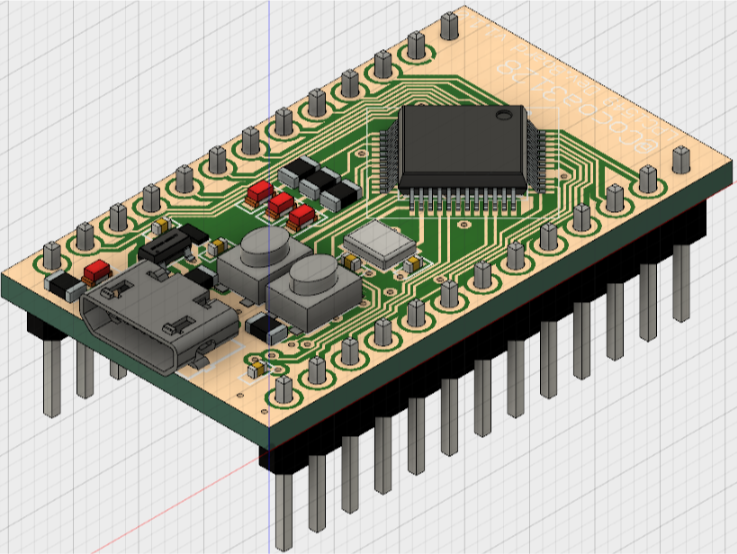

# LPC1549 Develpment Board  

小型で安価なLPCボードの開発を目指しています  

## 機能
* USBからのバスパワー給電に対応
* 保護ICによるUSB短絡保護
* COMPortを介した書き込みに対応し, 別途書き込み機が不要 
* 5[V], 3.3[V]の2レベル電源出力 
* 22本の独立したGPIO
* 3個のオンチップLED
* 1個のユーザーボタン
* AD変換用に2.5[V]リファレンスを搭載

## イメージ

上から見た画像  
  
  
下から見た画像